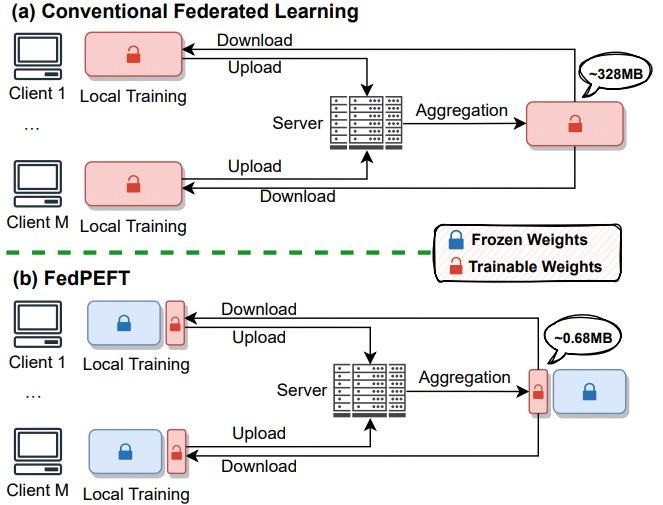
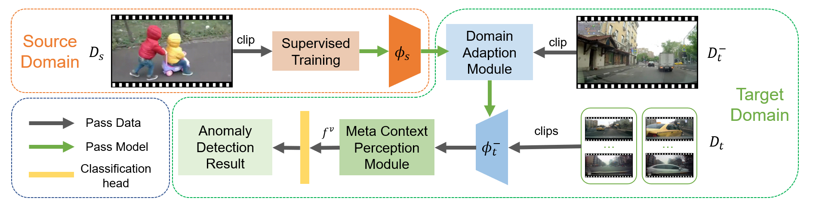

# <i class="fa fa-fw fa-copy"></i> Publications #

## Conference Paper ##
<table class="imgtable">
  <tr>
    <td>
      
    </td>
    <td align="left">
      

        <a href="http://likeyhnbm.github.io/publications/FedPerfix"><b>FedPerfix: Towards Partial Model Personalization of Vision Transformers in Federated Learning</b> </a>
        <b>Guangyu Sun</b>, Matias Mendieta, Jun Luo, Shandong Wu, Chen Chen. 
        <i>2023 IEEE/CVF International Conference on Computer Vision. </i><b>ICCV 2023</b>. 
        [<a >Paper (Coming Soon)</a>][<a>Code (Coming Soon)</a>]
      

    </td>
  </tr>
</table>

## Journal Articles ##
<table class="imgtable">
  <tr>
    <td>
      
    </td>
    <td align="left">
      

        <a href="http://likeyhnbm.github.io/publications/electric">
        <b>Deep Learning Detection of Inaccurate Smart Electricity Meters: A Case Study</b></a> 
        Ming Liu*, Dongpeng Liu*, <b>Guangyu Sun</b>, Yi Zhao, Duolin Wang, Fangxing Liu, Xiang Fang, Qing He, Dong Xu. 
        <i>IEEE Industrial Electronics Magazine</i> 
        [<a href="https://ieeexplore.ieee.org/document/9300285">Paper</a>]
      

    </td>
  </tr>
</table>

<table class="imgtable">
  <tr>
    <td>
     <a href="http://likeyhnbm.github.io/publications/water">
      
    </td>
    <td align="left">
      

        <a href="http://likeyhnbm.github.io/publications/water">
        <b>Assessing environmental oil spill based on fluorescence images of water samples and deep learning</b> </a> 
        Dongpeng Liu, Ming Liu, <b>Guangyu Sun</b>, Zhiqian Zhou, Duolin Wang, Fei He, Jiaxin Li, Ryan Gettler, Eric Brunson, Jeffery Steevens, Dong Xu 
        <i>Journal of Environmental informatics</i> 
        [<a href="https://pubs.er.usgs.gov/publication/70243648">Paper</a>]
      

    </td>
  </tr>
</table>

## Preprints ##
<table class="imgtable">
  <tr>
    <td>
    
    </td>
    <td align="left">
      

        <a href="http://likeyhnbm.github.io/publications/FedPEFT">
        <b>Conquering the Communication Constraints to Enable Large Pre-Trained Models in Federated Learning</b> </a>
        <b>Guangyu Sun</b>, Matias Mendieta, Taojiannan Yang, Chen Chen 
        [<a href="https://arxiv.org/abs/2210.01708">Paper</a>]
      

    </td>
  </tr>
</table>

<table class="imgtable">
  <tr>
    <td>
     
    </td>
    <td align="left">
      

        <a href="http://likeyhnbm.github.io/publications/AnomalyCrossing">
        <b>Anomaly Crossing: New Horizons for Video Anomaly Detection as Cross-domain Few-shot Learning</b></a> 
        <b>Guangyu Sun*</b>, Zhang Liu*, Lianggong Wen, Jing Shi, Chenliang Xu 
        [<a href="https://arxiv.org/abs/2112.06320">Paper</a>]
        [<a href="https://github.com/likeyhnbm/AnomalyCrossing">Code</a>]
      

    </td>
  </tr>
</table>
